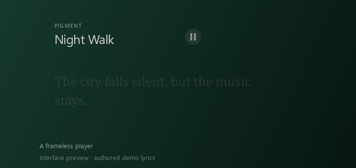
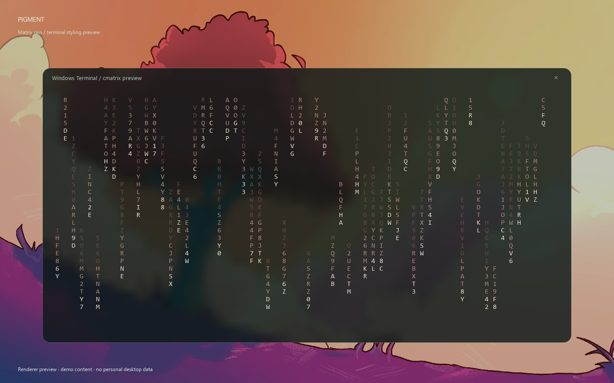
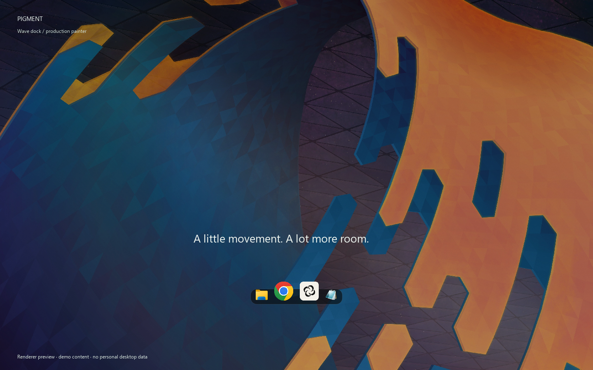

<div align="center">


# Pigment

### Your wallpaper. Your atmosphere.

Wallpaper colors, glass widgets, a wave dock, and a terminal that belongs to your desktop.


[](LICENSE)

**English** · [Русский](README.ru.md)

**[Website](https://ddrakkx.github.io/pigment/)** ·
**[Download](https://github.com/Ddrakkx/pigment/releases/tag/v0.1.5-beta)** ·
[Gallery](docs/GALLERY.md) · [Report a bug](https://github.com/Ddrakkx/pigment/issues)

[](https://github.com/Ddrakkx/pigment/releases/download/v0.1.3-beta/Pigment-music-preset.mp4)

**[▶ Watch the live demo · 24 seconds](https://github.com/Ddrakkx/pigment/releases/download/v0.1.3-beta/Pigment-music-preset.mp4)**

</div>

## Make the terminal part of your desktop

Pigment brings the colors of your current wallpaper into Windows Terminal:
background, tabs, selection, and cursor. Add transparency and blur, show the
rotating ASCII logo, or switch to a CRT-inspired retro style.

| Command | What it does |
| --- | --- |
| `neofetch` / `fastfetch` | Rotating Pigment logo, system info, and palette swatches |
| `blur on` / `blur off` | Toggle terminal background blur |
| `transparency 70` | Set background transparency; `opacity 70` sets opacity instead |
| `cmatrix` | Wallpaper-colored character rain that follows the window size |
| `cava` | Audio bars with held peaks and a gradual fall |
| `vis` | A symmetrical wave with bass at the center |
| `pigment-help` | Show the available terminal commands |

These are Pigment's PowerShell commands. Enable terminal integration in Pigment
and open a new terminal session. For an existing PowerShell session:

```powershell
. "$env:LOCALAPPDATA\Pigment\fetch\pigment-tools.ps1"
```

`cava` and `vis` use Windows audio through the running Pigment app.
They are separate renderers. Their original Linux counterparts are available
with `cava --linux` and `vis --linux` when installed in WSL.

**Ctrl+Alt+T opens ordinary Windows Terminal**, using Pigment's colors and
transparency. `term 640 360 cava` opens another Windows Terminal window
(width, height, optional `shell`, `logo`, `cmatrix`, `cava`, `vis`, or `clock`).
`term-size 640 360` resizes the current Windows Terminal window, within its
native size limits. CAVA, VIS, and the logo have no persistent instruction
captions. These commands are available in beta 0.1.2.

Run **`music`** to arrange the rotating logo, Matrix rain, clock, CAVA, and VIS
around Pigment's player and lyrics on the secondary display. The layout follows
the player when it moves and adapts to screen size. Repeating `music` reuses its
windows. Pigment's desktop clocks hide while the preset is active and return
after `music off`. This closes the preset windows while keeping the terminal
where you typed the command open. All preset windows are ordinary Windows Terminal.
Press Escape in a preset window to close that effect. The animations keep running
until you stop them. Hollywood uses an isolated tmux server that is cleaned up
when its terminal session ends.
`hollywood` launches the original Linux program through WSL; install it with
`sudo apt install hollywood` if it is not available in your Linux distribution.

| CAVA — peak bars | VIS — bass wave |
| --- | --- |
|  |  |

*Gallery scenes use demo content. Terminal frames are renderer previews, not
captures of an interactive Windows Terminal session; spectra use a demo signal.*

## One palette, across the desktop

| Feature | What you get |
| --- | --- |
| **Ready-made styles** | Glass, Quiet, and Music, with a preview and restore option |
| **Widgets** | Clock, calendar, and player; choose which display they appear on |
| **Wave dock** | Magnifying icons, pinned apps, running windows, and overflow scrolling |
| **Music** | Windows media controls, LRC search, custom files, and per-track timing offsets |
| **Wallpaper picker** | `Ctrl+Alt+W`, a combined library, color filters, and sorting |
| **Integrations** | Windows colors, Windows Terminal, and optional external desktop tools |

Static wallpapers and live wallpapers are supported. The clock, calendar, and
dock work without Wallpaper Engine. Two bundled procedural live wallpapers
require Wallpaper Engine; applying them does not require a Workshop subscription.

## A player that leaves the wallpaper room to breathe

The **Text** player keeps the title and pause button available. Previous/next
and progress appear on hover; lyric lines transition below the header. If LRC
is unavailable, the empty lyric area stops intercepting desktop clicks.



Open **Music → Player style → Text**. The development build adds **Text reveal**:
word by word, exact word timestamps only, or whole lines. Word reveal from
ordinary line-timed LRC is approximate; exact word timestamps are used when available.
Available in beta 0.1.2. Lyrics are not available
for every track. Music widgets need a player that exposes Windows media controls.

## Gallery

| Matrix styling preview | Wave dock — production painter |
| --- | --- |
|  |  |

[See the full gallery, including the appearance page and installer →](docs/GALLERY.md)

## Updates from inside Pigment

Open **Updates** to check for a new release and press **Update**. Pigment downloads
the official installer, verifies its SHA-256, closes for installation, and starts
again. Settings and wallpapers stay in place. Portable builds update in their
existing folder; installer builds retain the previous installed generation.

Automatic checks run after startup and every six hours. You can disable them or
exclude beta releases. Nothing is downloaded or installed without pressing Update.
The updater starts with **0.1.2 beta**; older versions need one manual installation.
The update installation cycle has not yet been verified on a clean Windows system.

## Install

Download from the [beta release](https://github.com/Ddrakkx/pigment/releases/tag/v0.1.5-beta):

| Download | Start here |
| --- | --- |
| **Pigment-0.1.5-beta-setup-x64.exe** | Experimental branded installer; per-user install, Start menu, optional desktop shortcut |
| **Pigment-0.1.5-beta-windows-x64.zip** | Portable build: extract the entire archive, then run `Pigment/Pigment.exe` |

No Python installation is needed. Keep `_internal` next to the portable exe.
In Pigment, open **Appearance → Glass**, choose a display, and apply the style.
Settings are also available from the tray icon.

The app opens in **English** by default. Choose **Русский** in the welcome tour
or under **Desktop → More settings → Interface language** and restart Pigment.
Updates keep an existing explicit language choice.

The installer has English and Russian UI, uses `%LOCALAPPDATA%\Programs\Pigment`,
and does not request administrator privileges. Autostart is configured inside
Pigment. Removal preserves settings. Starting with 0.1.3 beta, the uninstaller
offers to restore backed-up appearance by default; restoration errors stop
removal and produce a report. [Installer details](docs/INSTALLER.md).

## Beta status

- The app passed 57 automated scenarios in the previous release check, including
  two native window checks on the second display. No new automated suite was run
  for this English interface update.
- The packaged exe passed an isolated check with fresh settings and no Python
  paths. A clean Windows installation has not been verified.
- In the last switching check, Wallpaper Engine refused its command with code 5.
  Switching in that environment and the cause of an earlier WE crash remain unresolved.
- Windows pin import can be incomplete. Apps can be pinned manually in Pigment's Start menu.
- Gallery and painter benchmarks do not establish real display FPS.
- **The installer is unsigned and experimental. It compiles and its UI has been
  previewed; the complete install/uninstall cycle has not been checked yet.**

[Earlier check log, in Russian](RELEASE_CHECKS.md) · [Beta release notes](RELEASE_NOTES.md)

## Downloads and support

This public repository contains downloads, documentation and the gallery.
Application source code is maintained privately.

## License

Pigment code and the two procedural live wallpapers are [MIT](LICENSE).
Bundled photographs are CC BY-SA 4.0: [credits and originals](assets/wallpapers/CREDITS.md).
Dependencies keep their own licenses: [third-party notices](THIRD_PARTY_NOTICES.md).
Steam Workshop wallpaper files are not bundled.
