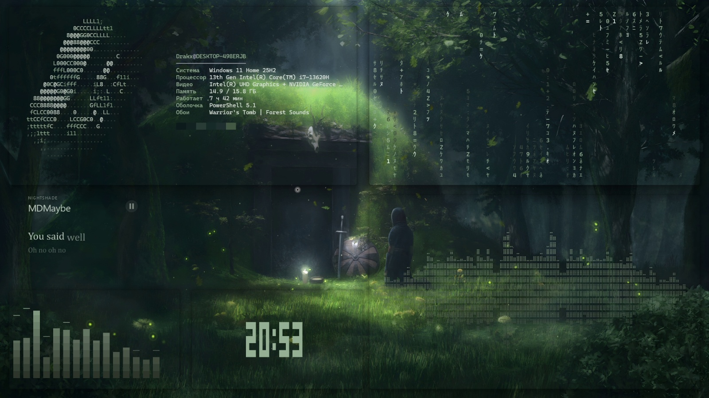
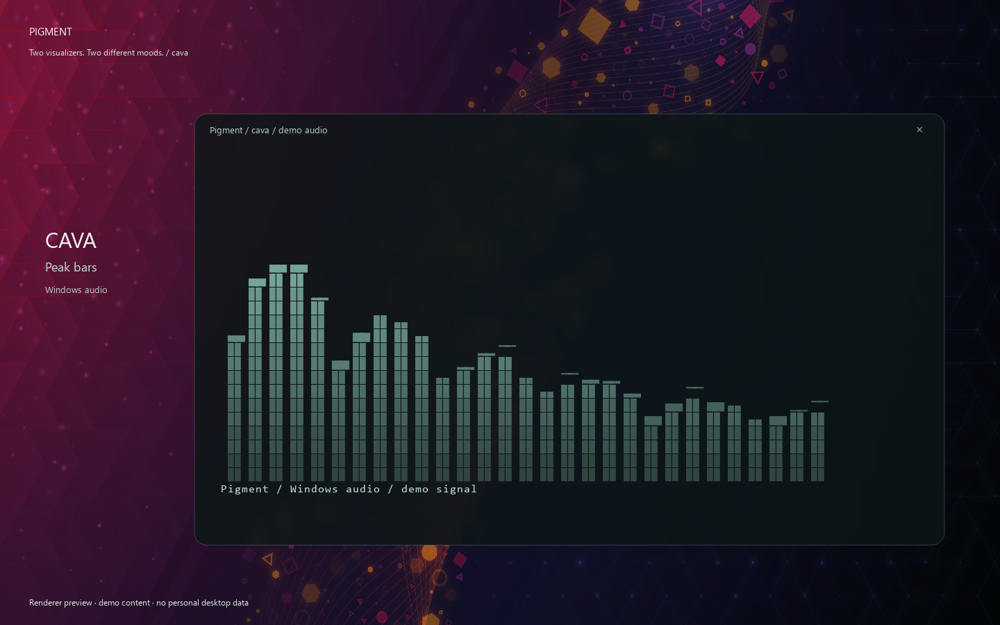
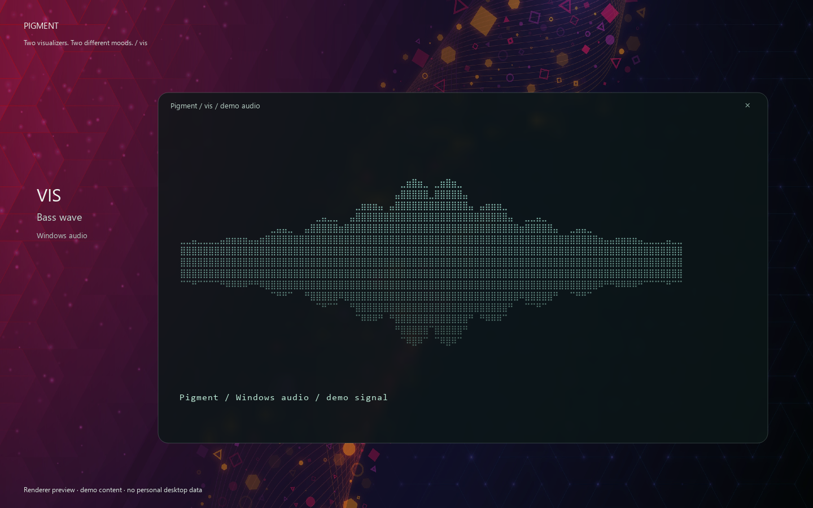
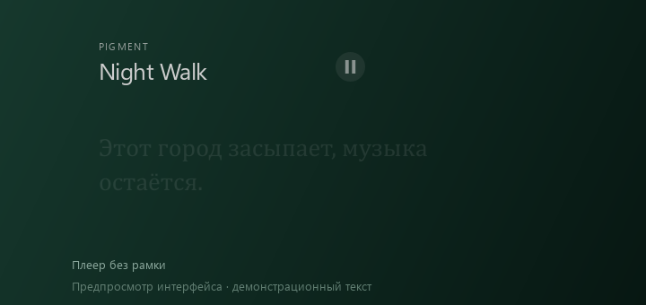

# Pigment

[English](README.md) · **Русский**

### Обои задают цвет. Pigment собирает рабочий стол.

Стеклянные виджеты, док с волной увеличения, музыка и терминал в одной палитре.

**[Сайт](https://ddrakkx.github.io/pigment/)** ·
**[Скачать beta](https://github.com/Ddrakkx/pigment/releases/tag/v0.1.7-beta)** ·
[Инструкция](docs/GUIDE.md) ·
[Сообщить о баге](https://github.com/Ddrakkx/pigment/issues)

**[▶ Смотреть живое демо · 24 секунды](https://github.com/Ddrakkx/pigment/releases/download/v0.1.3-beta/Pigment-music-preset.mp4)**

## Твой рабочий стол, одна палитра

Pigment подбирает фон и акцент под текущие обои и применяет их к своим
виджетам, Windows и Windows Terminal. Поддерживает статичные и живые обои.

| | Возможности |
| --- | --- |
| **Стекло** | Часы, календарь и плеер; готовое оформление в один клик |
| **Док** | Волна увеличения значков, закрепления, открытые окна и прокрутка |
| **Музыка** | Управление медиаплеером Windows, LRC, сдвиг тайминга и свой файл |
| **Обои** | Общая лента `Ctrl+Alt+W`, фильтр по цвету и сортировка |
| **Терминал** | `neofetch`, `cmatrix`, столбики `cava` и волна `vis` |
| **Настройки** | Выбор экрана для виджетов и возврат своих настроек оформления |

## Галерея и терминал

[Все кадры](docs/GALLERY.md): терминал с вращающимся знаком, столбики CAVA,
волна VIS, Matrix, док и окно установщика. Сцены помечены как предпросмотры;
для спектра используется демонстрационный сигнал.

| Столбики CAVA | Волна VIS |
| --- | --- |
|  |  |

Терминал умеет подхватывать цвета обоев, показывать вращающийся знак,
размывать фон и менять прозрачность командами `blur on` и `transparency 70`.
Есть режим ретро с CRT-шейдером. `cmatrix` учитывает размеры окна;
`cava` и `vis` получают системный звук через запущенный Pigment.

**Ctrl+Alt+T открывает обычный Windows Terminal** с цветами и прозрачностью
Pigment. Команда `term 640 360 cava` открывает ещё одно окно заданной ширины
и высоты; режимы: `shell`, `logo`, `cmatrix`, `cava`, `vis`, `clock`.
`term-size 640 360` меняет размер текущего Windows Terminal в пределах его
собственных ограничений. Постоянные подписи у CAVA, VIS и логотипа убраны.
Эти команды доступны в beta 0.1.2.

Команда **`music`** расставляет вращающийся логотип, Matrix, часы, CAVA и VIS
вокруг плеера и текста песни на втором экране. Раскладка учитывает размер экрана
и перестраивается при переносе плеера. Повторный вызов использует те же окна;
Обычные часы Pigment временно скрываются и возвращаются после `music off`.
Эта команда закрывает окна пресета, сохраняя терминал, в котором её ввели.
Все окна пресета — обычный Windows Terminal.
Esc в окне пресета закрывает соответствующий эффект. Анимации работают до
остановки. Hollywood запускается в отдельном сервере tmux, который завершается
вместе с его сеансом терминала.
`hollywood` запускает оригинальную Linux-программу через WSL. Если её ещё нет
в вашем дистрибутиве: `sudo apt install hollywood`.

## Установщик

На странице релиза доступен **Pigment-0.1.7-beta-setup-x64.exe**:
тёмное окно в стиле Pigment, English / Русский, установка для текущего
пользователя, ярлык в Пуске и дополнительный ярлык на рабочем столе.
Автозапуск настраивается внутри приложения.

По умолчанию приложение открывается на английском. Русский можно выбрать
при знакомстве или в **Рабочий стол → Дополнительные настройки → Язык интерфейса**,
затем перезапустить Pigment. Ранее выбранный русский сохраняется при обновлении.

С версии 0.1.3 beta при удалении включена галочка **«Вернуть оформление до
Pigment»**. Сначала восстанавливаются сохранённые изменения, затем удаляется
программа. При ошибках удаление останавливается и показывает путь к отчёту.
Настройки и резервные копии сохраняются.

Установщик пока экспериментальный и без цифровой подписи. Компиляция и
предпросмотр интерфейса выполнены; полный цикл установки и удаления ещё
не проверен. [Как он работает](docs/INSTALLER.md).

## Плеер «Текст»

Название и пауза доступны постоянно. Переключение и прогресс появляются
при наведении; слова плавно сменяются ниже. Если LRC нет, пустая полоса
под словами не остаётся. Настройка: **Музыка → Вид плеера → Текст**.

*Предпросмотр настоящего рисовальщика Pigment с демонстрационным текстом.*
В текущей версии кода есть настройка **Появление текста**: по словам,
только по точным меткам или целой строкой. Для обычного LRC пословное
появление приблизительное; при наличии меток слов используются они.
Доступно в beta 0.1.2. Текст есть не для каждой песни.

## Обновления из приложения

Открой **Обновления**, проверь новую версию и нажми **Обновить**. Pigment скачает
официальный установщик, сверит SHA-256, закроется на время установки и запустится
снова. Настройки и обои сохраняются. Портативная версия обновляется в той же
папке; установочная сохраняет предыдущую установленную версию.

Проверка выполняется после запуска и каждые шесть часов. Автопроверку и получение
beta-версий можно выключить. Скачивание и установка начинаются только по кнопке.
Функция появляется в **0.1.2 beta**: предыдущие версии нужно один раз обновить вручную.
Цикл обновления на чистой Windows пока не проверен.

## Запуск за минуту

1. Скачай **Pigment-0.1.7-beta-windows-x64.zip** на странице релиза.
2. Распакуй **весь архив** в постоянную папку. Оставь `_internal` рядом с exe.
3. Запусти **Pigment/Pigment.exe**. Установка Python не нужна.
4. В окне настроек открой **Оформление → Стекло**, выбери монитор и примени.

Pigment остаётся в системном трее. Часы, календарь и док работают без
Wallpaper Engine. Для наших двух встроенных живых обоев нужен установленный
Wallpaper Engine; они применяются из Pigment без подписки в мастерской.
Музыкальные виджеты требуют плеер, передающий данные в управление медиа Windows.

## Что ещё проверяем

Это первая **beta для Windows 11 x64**, не стабильный релиз.

- Проверены 57 автоматических сценариев, включая настоящие окна на втором экране.
- Готовый exe прошёл отдельную проверку с новыми настройками и без путей к Python.
  Первая установка на чистой Windows ещё не проверена.
- В последнем прогоне текущий Wallpaper Engine отказал команде с кодом 5.
  Переключение обоев сейчас не подтверждено; причина прежнего падения WE не установлена.
- Все закрепления Windows импортируются не гарантированно. Программу можно
  закрепить вручную через Пуск Pigment.
- Реальная плавность дока и визуализаторов зависит от системы; замеры рисовальщика
  не подтверждают частоту кадров на экране.

[Результаты проверок](RELEASE_CHECKS.md) · [Изменения beta](RELEASE_NOTES.md)

## Скачивания и поддержка

Здесь опубликованы готовые сборки, документация и галерея.
Исходный код приложения хранится приватно.

## Лицензия

Код Pigment и наши процедурные живые обои — [MIT](LICENSE).
Встроенные фотографии — CC BY-SA 4.0; [авторы и оригиналы](assets/wallpapers/CREDITS.md).
Библиотеки сохраняют собственные лицензии: [third-party notices](THIRD_PARTY_NOTICES.md).
Файлы обоев Steam Workshop в сборку не входят.
