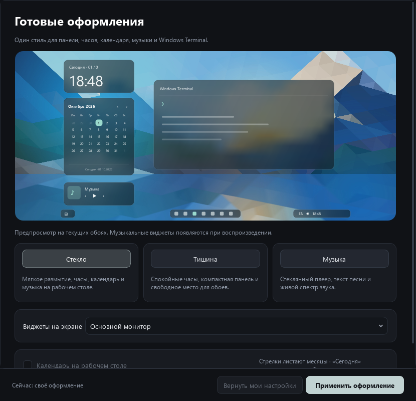

# Pigment

Подстраивает интерфейс Windows под текущие обои. Берёт цвет прямо с рабочего
стола — поэтому работает не только со статичной картинкой, но и с живыми
обоями: видео, HTML, любой движок.

## Быстрый старт

1. Распакуй архив сборки для Windows целиком в постоянную папку.
2. Запусти `Pigment/Pigment.exe`. Python для готовой сборки не нужен.
3. Открой **«Оформление» → «Стекло»**, выбери экран для виджетов и нажми
   **«Применить оформление»**.

Стекло, календарь, часы и панель работают без Wallpaper Engine. Он нужен
для живых обоев; статичные можно выбрать прямо в Pigment.

## Готовые оформления

В PowerShell, открытом через Pigment, работают короткие команды:
`blur`, `blur on`, `blur off`, `transparency 70`, `opacity 70`, `pigment-help`.
Прозрачность 70% означает плотность фона 30%; заданное число сохраняется
без автоматического увеличения плотности на светлых обоях. В уже открытом
терминале обновите команды строкой
`. "$env:LOCALAPPDATA\Pigment\fetch\pigment-tools.ps1"` или откройте новый.

`neofetch` / `fastfetch` перестраивают знак и сведения под размер окна,
`cmatrix` заполняет всю видимую высоту и учитывает изменение размера.
`cava` / `vis` показывают собственный спектр Pigment из системного звука
Windows; приложение должно работать. Это команды Pigment, а не Linux CAVA.
Оригинальные программы WSL доступны как `cava --linux` и `vis --linux`.
`cava` рисует столбики с пиками, `vis` — симметричную волну с басом в центре.

Текст песни ищется в [LRCLIB](https://lrclib.net), сначала для конкретного
альбома, затем в [Megalobiz](https://www.megalobiz.com) и
[NetEase](https://music.163.com). Доступность дополнительных источников
зависит от сети и самого сервиса. В базах бывают отсутствующие песни и
неточные тайминги. В «Музыка» можно загрузить
свой `.lrc`, повторить поиск и выставить сдвиг от −30 до +30 секунд
с шагом 0,25 секунды. Свой файл и сдвиг сохраняются отдельно для песни.
Если найдены только слова без тайминга, их можно прочитать отдельной кнопкой
в «Музыке». В режиме «Текст» без LRC остаются название и пауза; прогресс и
переключение появляются при наведении. В прежнем режиме под текстом
пустой блок скрывается после короткого титра. Обычные LRC переходят между строками плавно, без выдуманного
времени отдельных слов; настоящие метки слов сохраняются.

- **Стекло** — часы с живым размытием, календарь, мини-плеер и три компактных
  сегмента панели. Фон и акцент следуют за текущими обоями.
- **Тишина** — спокойные часы и компактная панель, без дополнительных
  карточек на рабочем столе.
- **Музыка** — плеер, синхронный текст песни и визуализатор системного звука.

Предпросмотр использует текущие обои. Оформление применяется к виджетам
Pigment и Windows Terminal; прозрачность произвольных сторонних приложений
оно не меняет. Музыкальная карточка появляется, когда что-то играет.

У календаря стрелки переключают месяц, строка **«Сегодня»** возвращает
текущий. Он остаётся под обычными окнами и скрывается в полноэкранном режиме
только на занятом экране. Смена месяца и подсветка текущего дня работают
без сети. Погода в эту версию не входит.

До первого выбора готового стиля сохраняются затронутые настройки.
**«Вернуть мои настройки»** восстанавливает их; обои, закреплённые программы,
собственные значки и позиции, не входящие в стиль, сохраняются.

Карточку плеера можно перетащить за обложку или название: место сохраняется
отдельно для каждого экрана. Наши календарь, плеер и текст песни обходят
другие виджеты Pigment с отступом. Элементы, нарисованные самими обоями,
не входят в эту раскладку — место рядом с ними можно выбрать вручную.

Док «Волна» увеличивает значок под курсором и соседние значки. Если программ
много, список можно прокрутить колесом или стрелками. В настройках рабочего
стола доступен компактный вид. Для закрепления любой программы, включая
приложения из магазина, откройте наш «Пуск» и выберите по правому клику
**«Закрепить на панели»**. По правому клику на кнопку Пуска дока можно
добавить доступные закрепления Windows; чтение современных закреплений
зависит от внутреннего формата Windows и может не охватывать все ярлыки.

## Как это работает

Цвет берётся **из файла текущих обоев**: кадр из него достаёт сама Windows,
и это ничего не стоит отрисовке. Дальше картинка квантуется, самый тёмный
цвет идёт в фон, самый выразительный — в акцент. Отдельно ищется
выразительный оттенок: мелкие цветные акценты занимают доли процента
пикселей и при обычном квантовании теряются, хотя глаз цепляется именно
за них. Отличить их от артефактов сжатия помогает концентрация тона —
настоящий цвет собран в одном секторе, шум размазан по кругу.

Если источник обоев не опознан (чужой движок, интерактивные обои), Pigment
переключается на запасной путь — снимок рабочего стола через `PrintWindow`
по окну `Progman`. Он работает с чем угодно, но заставляет систему
перерисовать стол целиком: замеры показали падение с 59 до 17 кадр/с на
одном из мониторов, когда такой снимок делался раз в полминуты. Поэтому
он именно запасной.

Pigment работает в одном экземпляре: повторный запуск открывает уже работающее
окно. Автоматическую перекраску можно поставить на паузу как в настройках, так
и через значок в трее. Смена живых обоев и полное применение выполняются в фоне,
поэтому окно настроек не зависает.

Цвет можно закрепить независимо от обоев. Автоматика умеет приостанавливаться
поверх полноэкранных приложений и при работе ноутбука от батареи.

### Проверка результата

Записать настройку и добиться результата — разные вещи. Поэтому цель, которая
умеет посмотреть на себя со стороны, делает это после применения: акцент и
подложка панели перечитываются из реестра, выделение и классические цвета
спрашиваются у самой системы через `GetSysColor`, схема терминала читается
обратно из его настроек, тема меню — из собранного файла. Если запись прошла,
а результата нет, в отчёте появляется «НЕ ПОДЕЙСТВОВАЛО» с причиной, а не
галочка об успехе.

Программы, которые Pigment запускает, проверяются по окнам, а не по наличию
процесса. Wallpaper Play, например, умеет подняться огрызком: обои рисуются,
иконка в трее висит, а интерфейса и дока нет вовсе — снаружи всё выглядит
работающим.

### Меню Snapse в противофазе фону

Остальное оформление идёт за обоями, но круговое меню открывается поверх
приложений, а не поверх рабочего стола, и на тёмном окне тёмное меню сливалось
с фоном. Поэтому Pigment смотрит не на обои, а на квадрат экрана вокруг
курсора — там, где меню вот-вот появится, — и переключает его на светлый набор
цветов над тёмным фоном и обратно. Акцент при этом остаётся от обоев.

Набор цветов подменяется через `menuThemeColors` в настройках Kando, без
перезапуска. Замер стоит около 7 мс и делается раз в 0.6 с; решение меняется
только после трёх одинаковых замеров подряд, иначе меню мигало бы каждый раз,
когда под курсором что-то перерисовалось. Отключается галочкой в настройках.

## Что умеет красить

| Цель | Требования |
|---|---|
| Акцент Windows | — |
| Цвет выделения (рамка, подсветка строк, выделенный текст) | — |
| Классические окна (диалоги вроде «Выполнить») | выключено по умолчанию |
| Подложка панели задач | Windhawk + мод Taskbar Background Helper, права администратора |
| Тема радиального меню Kando | файл `theme.css.template` рядом с темой |
| Иконки дока Wallpaper Play | Wallpaper Play, перезапуск оболочки |
| Windows Terminal — фон, вкладки, выделение, курсор | установленный Windows Terminal |
| Подсветка устройств | мышь, клавиатура или коврик с поддержкой LampArray |

Каждая цель сама проверяет, есть ли на машине то, что ей нужно, и отключается
с понятной причиной, если нет. Список в окне настроек строится из этого же
набора — он не прописан в интерфейсе руками.

## Выбор обоев

Во вкладке **«Обои»** — вся библиотека движка обоев с превью. Миниатюры
делаются локально, кадром из самого видеофайла, без обращения к сети.
Рядом с названием показаны разрешение и вес: тяжёлые обои (2560 точек и
шире) подсвечены, потому что на слабой видеокарте или на двух мониторах
именно они начинают дёргаться.

Кружки рядом с поиском — фильтр по цвету: красные, синие, светлые, тёмные и
так далее. Цвета Pigment определяет сам по кадру обоев.

**Лента выбора** — `Ctrl+Alt+W`, пункт «Выбор обоев» в трее или
`Pigment.exe --wallpapers` (удобно повесить на круговое меню). Обои на весь
экран лентой наклонных карточек: листать стрелками или колесом, Enter —
поставить. Новые обои кругом расходятся от центра по всему экрану и держатся,
пока движок обоев перезапускается, так что пустого рабочего стола не видно.

Лента объединяет пять встроенных статичных, два наших живых варианта,
установленные обои Wallpaper Play и Wallpaper Engine и текущие обои Windows.
Выбранная подборка во вкладке настроек не ограничивает ленту. Повторы
убираются, а каждый элемент применяется через его собственный источник.

Под цветными кружками есть меню **«Сортировка»**: по источнику, по цвету,
сначала новые, сначала старые и по названию. `S` переключает порядок;
выбор сохраняется между открытиями. Новизна определяется датой появления
локального файла или папки проекта; встроенные обои без даты загрузки идут
в конце. По цвету обои группируются по главному оттенку миниатюры, затем
светлые и тёмные; кружки оставляют только обои выбранного цвета.
Результаты анализа миниатюр сохраняются, а выбранные обои остаются в центре
при смене сортировки.

При переходе на Wallpaper Play Pigment закрывает только обои Wallpaper Engine,
оставляя сам WE в фоне: возврат не требует полного запуска программы.
При переходе на WE отключается Wallpaper Play, чтобы он не перекрывал обои.
Запуск WE при необходимости идёт без открытия его каталога; команда смены
обоев не ждёт завершения фонового процесса. Встроенные живые
обои также автоматически переходят на Wallpaper Engine. Повторный выбор
текущих обоев WE отключает конкурирующий Wallpaper Play. Ошибка применения
остаётся в журнале и показывается уведомлением, даже если лента уже закрылась.

Обои Wallpaper Engine из Pigment применяются на все подключённые мониторы.
Если выбранные обои уже стоят только на одном экране, повторный выбор
устанавливает их и на остальные. Успех проверяется для каждого экрана.

Источники обоев подключаются так же, как цели покраски — отдельным модулем.
Сейчас поддержан Wallpaper Play.

## Часы на рабочем столе

Во вкладке **«Часы»** можно вывести аккуратные часы на основном, всех или
конкретном мониторе. Они закрепляются над рабочим столом, но остаются под
обычными программами; отдельная опция включает режим «Поверх окон».

Стили: минимал, стекло с живым размытием под часами, стопка (часы над
минутами), плакат, классика с засечками, моно, неон, светодиодное табло из
точек, перекидные карточки и кольца часов, минут и секунд.

Общие правила для всех стилей взяты из часов, которые люди держат на экране
годами, — экран блокировки iOS, Pixel, скины Rainmeter вроде Mond и Elegance:
размер цифр не прыгает от минуты к минуте, двоеточие стоит на середине высоты
цифр, дата пишется словами маленькой строкой над временем («среда,
23 сентября»), текст прижат к тому краю экрана, у которого стоят часы, тень
мягкая и размытая, а цифры сменяются плавным проявлением.

Режим **«Авто»** подбирает стиль под текущие обои и пишет, почему выбрал
именно его. Сначала смотрит на название обоев: «pixel» или «minecraft» дают
табло, «neon» или «cyber» — неон, «space» или «moon» — кольца, «torii» или
«sakura» — классику. Если подсказки в названии нет, решает по картинке:
тёмные обои с яркими пятнами — неон, светлые — минимал, пёстрые — плакат,
насыщенные цветные — карточки, тёмные спокойные — кольца, тёмные
монохромные — моно.

Положение **«Авто»** ставит часы в самое спокойное место обоев из девяти
(углы, края, центр): туда, где меньше деталей и перепадов яркости — на небо,
туман или стену, а не на персонажа. Середина низа и центр идут со штрафом:
там обычно док и главный герой картинки. При смене обоев часы переезжают
сами; на странице часов написано, куда они встали.

Цвет по умолчанию берётся от обоев и подстраивается под участок прямо под
часами: на светлом небе цифры тёмные, на тёмном — светлые. Можно закрепить
всегда светлые, всегда тёмные или собственный цвет. Ещё есть дата и секунды,
размер, непрозрачность, пропуск кликов и скрытие только на том экране, где
открыто настоящее полноэкранное приложение. Режим **«Разместить мышью»**
позволяет перетащить часы в нужное место и сохраняет позицию отдельно для
каждого монитора.

## Программы в цветах обоев

Вкладка **«Программы»**: одна палитра обоев для всего, как у рисинга на Linux.
Из цветов обоев строится тёмная тема — почти серые фоны с лёгким оттенком
обоев и один яркий акцент, — и её получают:

- **Сайты в браузере.** Расширение Pigment (папка
  `%LOCALAPPDATA%\Pigment\browser-extension`, ставится один раз через
  `chrome://extensions` → «Режим разработчика» → «Загрузить распакованное»)
  красит Telegram Web, YouTube и Spotify Web через их собственные переменные
  цвета, а на остальных сайтах — выделение текста и полосы прокрутки. Цвета
  оно берёт у Pigment через `127.0.0.1:47863`, наружу ничего не уходит, и
  сайты перекрашиваются вместе с обоями без перезагрузки.
- **Discord** через тему для [Vencord](https://vencord.dev): Vencord сам
  перечитывает тему, Discord меняет цвета на лету.

## Мини-плеер

Вкладка **«Музыка»**: стеклянная карточка на рабочем столе с живым размытием
под ней — обложка, название, исполнитель, кнопки «назад», «пауза», «вперёд» и
тонкая полоса прогресса; по полосе можно щёлкнуть, чтобы перемотать. Цвет
полосы берётся из обложки. Плеер ничего не играет сам — он управляет тем, что
уже играет: Spotify, YouTube в браузере, Яндекс Музыкой, любым плеером с
кнопками в окне громкости Windows. Входить в аккаунты не нужно. Когда ничего
не играет, карточка прячется.

## Текст песни на обоях

Вкладка **«Текст песни»**: строчки играющей песни появляются прямо на обоях,
слово за словом, в такт музыке. Прошлая строка уходит вверх и гаснет, на паузе
текст тает. Работает со Spotify, YouTube в браузере и любым плеером, который
показывает кнопки управления в окне громкости Windows: что играет и на какой
секунде, Windows сообщает сама, без ключей и входа в аккаунты.

Тексты с таймингом по строкам берутся из открытой базы
[LRCLIB](https://lrclib.net): туда уходит только название трека и исполнитель.
Названия роликов вроде «Исполнитель - Песня (Official Video)» приводятся к
нормальному виду. Найденные тексты хранятся на компьютере и повторно не
запрашиваются.

Строка появляется чуть раньше, чем её начинают петь, — чтобы успеть
прочитать. Насколько раньше, зависит от скорости пения: её видно по самому
тексту. В медленной песне строка появляется почти на секунду раньше, в
быстром речитативе — на пару десятых, иначе прошлая исчезала бы раньше, чем
её допели. По желанию под текущей строкой бледно видна следующая, как в
Spotify и Apple Music. Если у отдельной песни в базе сбит тайминг, его можно
поправить ползунком на вкладке — сдвиг запоминается только для этой песни.

При смене трека на том же месте появляется титр, как в кино: название
курсивом и исполнитель под ним. Если у песни есть вступление без слов, титр
держится до первой строки. Если текста нет или это музыка без слов, он висит
6 секунд и тает.

Место по умолчанию — «Авто»: самое спокойное из шести мест в нижней половине
экрана, как субтитры. Цвет — оттенок обоев, светлый на тёмном и тёмный на
светлом. Шрифт с засечками или без, размер, монитор.

## Визуализатор звука

Полосы спектра того, что звучит в колонках, прямо на обоях и в их цвет —
столбиками, от центра или волной. Звук Pigment берёт у Windows штатным
способом (WASAPI loopback): без виртуальных кабелей, микрофона и сторонних
библиотек. Звук нигде не сохраняется и никуда не уходит. В тишине
визуализатор гаснет и перестаёт перерисовываться. Включается во вкладке
«Музыка».

## Своя панель и меню Пуск

Галочка «Своя панель внизу вместо панели задач Windows» на вкладке «Рабочий
стол» (или `Pigment.exe --panel=on` / `--panel=off`). Три стеклянные пилюли в
цвет обоев: слева Пуск и играющий трек, по центру закреплённые и открытые
программы, справа раскладка, звук и сеть, заряд, часы. Значки можно
перетаскивать и менять (правый щелчок → «Сменить значок…»). Панель задач
Windows уходит в автоскрытие: трей открывается стрелкой справа или если
довести мышь до края экрана. Развёрнутые окна встают над панелью.

**Ctrl+Alt+T** открывает Windows Terminal, как на Linux.

Меню Пуск Pigment открывается кнопкой на панели или клавишей Win: поиск
(печатать можно сразу), закреплённые (перетаскиваются), все программы —
тот же список, что у Пуска Windows, включая игры Steam и приложения из
магазина, — и питание. Сочетания с Win (Win+E, Win+D…) работают как обычно.
Правый щелчок по кнопке Пуск — Пуск Windows, меню Win+X, диспетчер задач и
переключатель клавиши Win.

## Редактор меню Snapse

Во вкладке **«Меню Snapse»** можно без ручного редактирования JSON:

- видеть структуру меню на живом круговом предпросмотре и выбирать раздел прямо на нём;
- добавлять, переименовывать, удалять и переставлять разделы радиального меню;
- наполнять каждый раздел программами, ссылками и горячими клавишами;
- искать установленные программы и приложения Microsoft Store по названию;
- менять подписи, Material-иконки и клавиши быстрого выбора;
- сохранять конфигурацию с автоматическим резервным копированием и перезапуском Snapse.

При перестановке разделов их углы равномерно пересчитываются, поэтому порядок
в редакторе совпадает с расположением элементов по кругу.

Запуски из Snapse проходят через небольшой `PigmentLaunch.exe`. Он запоминает
монитор, на котором пользователь выбрал пункт кругового меню, ждёт настоящее
окно программы и переносит его на этот экран. Это работает и при первом
запуске, и для уже открытого приложения. Для Discord помощник дополнительно
умеет разворачивать окно из системного трея.

Папки открываются отдельным окном Проводника. Поэтому вызов «Загрузок» на
втором мониторе не уносит туда существующее окно с рабочими вкладками.

Во вкладке обоев карточка сначала только выбирается, а движок перезапускается
после нажатия **«Применить выбранные»**. Там же есть поиск, а число карточек в
строке автоматически подстраивается под размер окна и масштаб экрана.

## Откат

Любая правка проходит через слой бэкапа: исходное значение запоминается
**один раз**, до первого вмешательства. Кнопка «Вернуть как было» возвращает
всё, включая значения, которых раньше не существовало — они удаляются.
Бэкап лежит в `%LOCALAPPDATA%\Pigment\backup.json`.
Если файл после применения был изменён другой программой или вручную, Pigment
не перезаписывает эту новую версию при откате.
То же правило действует для системных значений в реестре. Откат ждёт окончания
уже начатого применения, поэтому фоновая перекраска не может сработать после него.

## Установка

Скачайте установщик или портативную сборку из [релизов](https://github.com/Ddrakkx/pigment/releases).
Для портативной версии распакуйте весь архив и запустите
`Pigment/Pigment.exe`, оставив `_internal` рядом. Python не нужен.

## Осторожно

- **Классические окна** меняют палитру `COLOR_*`, которую читают старые
  программы. Если какая-то жёстко задаёт чёрный текст, рассчитывая на светлый
  фон, она станет нечитаемой. Поэтому цель выключена по умолчанию.
- **Подложка панели задач** пишет в `HKLM` и требует прав администратора.
- **Иконки дока** перезапускают движок обоев, поэтому в автоматический цикл
  не попадают — только по кнопке «Обновить с перезапуском».

## Лицензия

MIT

### Встроенная подборка обоев

Во вкладке «Обои» можно переключаться между библиотекой движка, пятью
встроенными статичными обоями в 4K, двумя собственными живыми вариантами
«Сияние» и «Орбита» и дополнительными рекомендациями из Steam Workshop.
Статичные обои применяются через Windows; активные обои Wallpaper Engine
при этом отключаются на всех мониторах. Wallpaper Play нужно предварительно
закрыть через его значок в трее.

Наши живые обои находятся в подборке «Наши · живые». Они входят в установку
и применяются прямо из Pigment через установленный Wallpaper Engine,
без сайта, входа в браузере и подписки. Анимации ограничены 30 кадрами/с
или более низким ограничением Wallpaper Engine, умеют приостанавливаться
и не используют интернет. Собственные рисунки и анимации — MIT.

Дополнительные обои мастерской требуют Wallpaper Engine: «Открыть в Steam» → «Подписаться» →
дождаться загрузки → «Обновить список» → «Применить выбранные».
Превью загружаются в локальный кеш при открытии подборки; файлы живых обоев
не входят в приложение.

Статичные изображения принадлежат их авторам и распространяются под
CC BY-SA 4.0. Авторы, оригиналы и сведения об изменениях перечислены в
`assets/wallpapers/CREDITS.md`; текст лицензии находится рядом.

### Возврат из приближённого окна

После ⤢ или пробела сверху появляется отдельная панель «Вернуться к обзору» /
«Остаться в окне». Она остаётся поверх настоящего окна, включая развёрнутые
окна. Возврат восстанавливает прежнее положение и масштаб доски. Кнопки
приближения и закрытия выбранной карточки видны постоянно и увеличены.

### Проверки перед выпуском

`python -m unittest discover -s tests -v` запускает проверки сохранения
развёрнутого состояния, быстрых кликов, переключения нескольких окон,
смены обоев и сортировки. Проверка WinAPI создаёт собственное временное
окно и выполняет по три цикла для развёрнутого и обычного состояния.
Она не сворачивает открытые окна пользователя и не меняет его обои.
